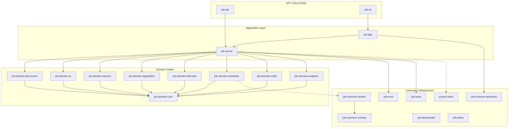

# Crate Boundary Design

This document describes the multi-crate modularization for the Job Automation
platform, covering the dependency graph, layering rules, and phased migration
plan.

## Crate Dependency Diagram

## Dependency Layers and Rules

The crates are organized into four layers. Dependencies **must** flow downward;
no crate may depend on a crate in a higher layer.

| Layer | Crates | May depend on |
|-------|--------|---------------|
| **4 -- Entry** | `job-cli`, `job-api` | Application, Domain, Common |
| **3 -- Application** | `job-app`, `job-server` | Domain, Common |
| **2 -- Domain** | `job-domain-*` | `job-domain-core`, Common (traits only) |
| **1 -- Common** | `job-base`, `job-error`, `job-common-*`, `yunara-store`, `job-paths` | External crates only |

### Key Rules

1. **Domain crates depend on `job-domain-core` only** -- never on each other.
   Cross-domain communication happens through domain events defined in `core`.

2. **`job-domain-core` has NO infrastructure dependencies** -- no store, no
   runtime, no telemetry.  It only contains traits, types, and events.

3. **Circular dependency prevention** -- use the *trait + interface crate*
   pattern: define traits in `core`, implement them in the domain or
   infrastructure crate, and wire them together in the application layer
   (`job-app` / `job-server`).

4. **Common crates must not contain business logic** -- they provide
   infrastructure primitives (error types, runtime helpers, storage, telemetry).

5. **Store implementations stay in infrastructure** -- domain crates define
   repository traits in `job-domain-core`; concrete Postgres/KV implementations
   live in `yunara-store` or dedicated adapter crates.

## New Crate Inventory

| Crate | Path | Purpose |
|-------|------|---------|
| `job-domain-core` | `crates/domain/core` | Shared domain IDs, status enums, repository traits, domain events |
| `job-domain-job-source` | `crates/domain/job-source` | Job source driver abstraction and implementations |
| `job-domain-ai` | `crates/domain/ai` | AI provider abstraction, prompt templates, model routing |
| `job-domain-resume` | `crates/domain/resume` | Resume version management and tailoring |
| `job-domain-application` | `crates/domain/application` | Application lifecycle state machine |
| `job-domain-interview` | `crates/domain/interview` | Interview scheduling and feedback tracking |
| `job-domain-scheduler` | `crates/domain/scheduler` | Cron / task scheduling orchestration |
| `job-domain-notify` | `crates/domain/notify` | Telegram / email notification dispatch |
| `job-domain-analytics` | `crates/domain/analytics` | Metrics aggregation and reporting |

## Migration Plan

### Phase 1 -- Skeleton Crates (this PR)

- Create all `crates/domain/*/` directories with `Cargo.toml` and `src/lib.rs`.
- Create `job-domain-core` with ID types, status enums, repository traits, and
  event definitions.
- Add all new crates to workspace members and `[workspace.dependencies]`.
- Verify `cargo check --workspace` passes.

### Phase 2 -- Extract Domain Types

- Move any domain-specific types that currently live in `job-server` or
  `job-app` into the appropriate domain crate.
- Update imports in existing crates to use re-exports from domain crates.
- Keep backward-compatible re-exports in old locations to avoid breaking
  downstream code.

### Phase 3 -- Implement Repository Traits

- For each repository trait in `job-domain-core`, create a concrete
  implementation backed by `yunara-store` (Postgres).
- Wire implementations via dependency injection in `job-app` / `job-server`.

### Phase 4 -- Domain Logic Migration

- Move business logic (state machines, validation, AI orchestration) from the
  monolithic server crate into domain crates.
- Each domain crate exposes a *service* struct that the server hands requests
  off to.

### Phase 5 -- Integration and Cleanup

- Remove dead code from `job-server` that was migrated.
- Add integration tests that exercise the full domain -> infrastructure path.
- Update CI to run `cargo check --workspace` and `cargo test --workspace`.
