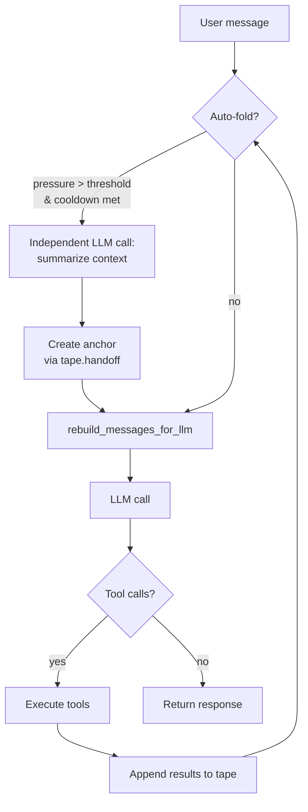
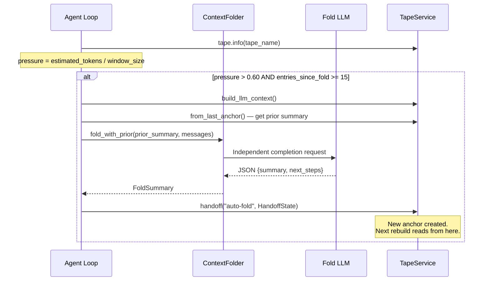

# Agent Loop & Context Folding

The agent loop is the core execution engine in `rara-kernel`. Each user message triggers a multi-iteration loop where the LLM reasons, invokes tools, and appends results to the tape. Context folding keeps the LLM context window healthy during long conversations.

## Agent Loop Overview



Each iteration:

1. **Auto-fold check** — measure context pressure, fold if needed (see below)
2. **Rebuild messages** — read entries from the last anchor forward, reconstruct `Vec<llm::Message>`
3. **LLM call** — send messages + tool definitions, stream response
4. **Tool execution** — run tool calls in parallel, append results to tape
5. **Pressure warning** — if context is at 70% or 85%, inject a warning for the next iteration

## Context Folding

### Problem

Long conversations accumulate context. Without management, the LLM eventually hits the context window limit. Before context folding, Rara relied on manual anchor creation (prompted by 70%/85% pressure warnings) — which depends on the LLM cooperating.

### Solution: Auto-Anchor

Context folding automatically compresses conversation history into a summary anchor when context pressure rises. This happens **before** the LLM sees the context, so the fold is invisible to the user.

```
0.0 ──── 0.60 ────── 0.70 ──────── 0.85 ──── 1.0
          │           │              │
     AUTO-FOLD     WARNING       CRITICAL
     (automatic)  (prompt LLM)  (force handoff)
```

Auto-fold at 0.60 keeps the context healthy. If it fails, the existing 0.70/0.85 warnings remain as fallback.

### How It Works



Key properties:

- **Independent LLM call** — the fold summarization does NOT go through the agent loop; it is a separate, short-context completion request
- **Tape is never truncated** — fold only affects what the LLM sees; all entries remain searchable
- **Hierarchical** — each fold receives the prior anchor's summary, so information accumulates naturally across multiple folds

### Cooldown

Without cooldown, folding could oscillate: fold reduces context, a few entries later pressure rises again, fold again, repeat.

Fold triggers only when **all** conditions are met:

| Condition | Default | Purpose |
|-----------|---------|---------|
| `pressure > fold_threshold` | 0.60 | Context is getting large |
| `entries_since_last_fold >= min_entries_between_folds` | 15 | Enough new content to justify a fold |
| `context_folding.enabled` | true | Feature is turned on |
| `!fold_failed_this_turn` | — | No fold failure in this turn yet |

The cooldown counter tracks entries since the last `phase: "auto-fold"` anchor, and **persists across turns** — it is recovered from tape state at the start of each `run_agent_loop` call.

### Failure Handling

Fold failures are non-fatal:

| Failure | Behavior |
|---------|----------|
| Fold LLM call fails | `warn!`, disable fold for this turn, fall back to 0.70/0.85 |
| Context build fails | `warn!`, disable fold for this turn |
| Anchor persistence fails | `warn!`, disable fold for this turn |

The `fold_failed_this_turn` flag prevents repeated failing calls in tool-heavy turns under pressure.

### Configuration

```yaml
# config.yaml
context_folding:
  enabled: true                    # toggle auto-fold on/off
  fold_threshold: 0.60             # pressure ratio to trigger fold
  min_entries_between_folds: 15    # cooldown entry count
  fold_model: null                 # null = use session model
```

All fields have defaults via `SmartDefault`. Setting `enabled: false` disables context folding entirely — the system reverts to the original manual-anchor behavior.

### ContextFolder

`ContextFolder` lives at `crates/kernel/src/agent/fold.rs`. It is an orchestration component (not part of the memory module) because it makes LLM calls.

| Method | Purpose |
|--------|---------|
| `fold_with_prior(prior_summary, messages, source_tokens)` | Compress conversation into `FoldSummary` |
| `fold_text(text, target_chars)` | Compress arbitrary text (used by P1 fold_branch) |
| `to_handoff_state(summary, pressure)` | Convert `FoldSummary` to `HandoffState` for anchor creation |

The fold prompt instructs the LLM to:
- Preserve user identity, factual information, decisions, and errors
- Delete greetings, redundant tool outputs, and intermediate reasoning
- Output structured JSON: `{"summary": "...", "next_steps": "..."}`
- Use the same language as the conversation

Summary length is dynamic: ~10% of source tokens, clamped to [256, 2048] tokens.

## Key Files

| File | Purpose |
|------|---------|
| `crates/kernel/src/agent/mod.rs` | Agent loop, pressure classification, auto-fold integration |
| `crates/kernel/src/agent/fold.rs` | `ContextFolder` — LLM-based summarization |
| `crates/kernel/src/kernel.rs` | `ContextFoldingConfig` |
| `crates/kernel/src/memory/service.rs` | `TapeService` — anchor persistence, `entries_after` |
