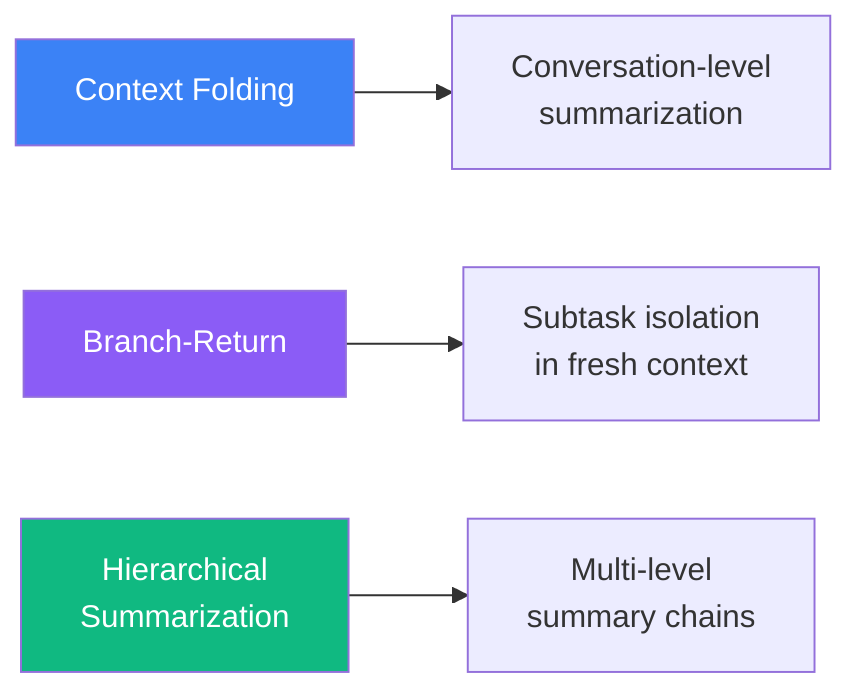
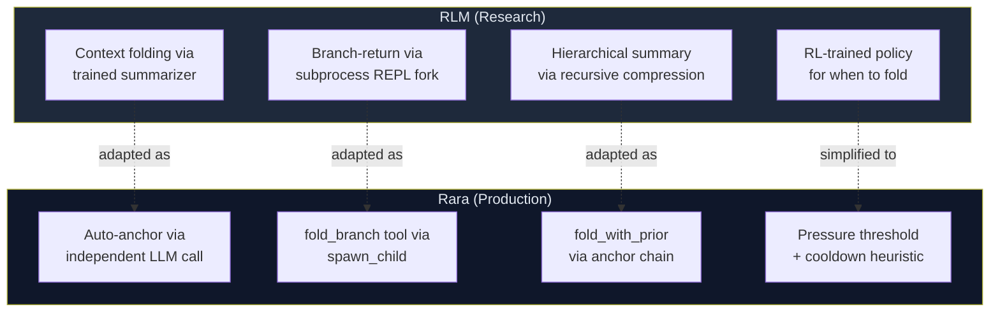
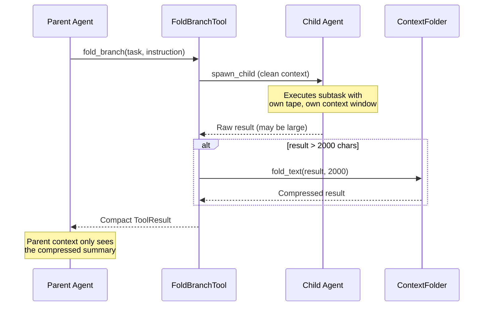
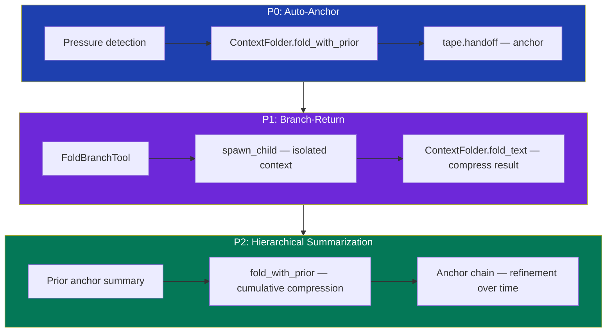

# Context Folding: From RLM to Rara

Rara's context folding mechanism draws inspiration from the [Reinforcement Learning for LLM Context Management (RLM)](https://www.primeintellect.ai/blog/rlm) research by Prime Intellect. This chapter explains the RLM concepts, how Rara adapts them, and where the two diverge.

## RLM: Core Ideas

RLM proposes that **the agent itself should manage its own context window**, rather than relying on fixed-length truncation or human-authored summarization rules. The key insight: an LLM agent that can read, write, and compress its working memory performs dramatically better on long-horizon tasks than one that passively waits for the context to overflow.

### Three Mechanisms

RLM introduces three complementary context management strategies:



| Mechanism | What it does | When it helps |
|-----------|-------------|---------------|
| **Context Folding** | Compress the current conversation into a summary checkpoint | Long conversations that accumulate stale context |
| **Branch-Return** | Fork a fresh context for a subtask, compress the result back | Complex subtasks that generate heavy intermediate reasoning |
| **Hierarchical Summarization** | Chain summaries so each fold builds on the previous one | Very long sessions where single-level summaries lose early details |

### The REPL Concept

In RLM, the agent interacts with a Python REPL as its primary tool — executing code, observing outputs, and iterating. The REPL produces large volumes of intermediate output (stack traces, data dumps, test results) that are valuable in the moment but become noise once processed. This is the core motivation for context management: **the agent needs to discard resolved context to make room for new reasoning**.

## Rara's Adaptation

Rara adapts RLM's ideas onto its existing **tape + anchor** architecture rather than building a separate context management layer. The result is a system that achieves the same goals with fewer moving parts.

### Architecture Mapping



| RLM Concept | Rara Implementation | Key Difference |
|-------------|-------------------|----------------|
| Trained summarizer | `ContextFolder::fold_with_prior()` | Uses the session's own LLM with a structured prompt instead of a separately trained model |
| REPL fork | `FoldBranchTool` + `spawn_child()` | Rara's tool system already provides REPL-equivalent capabilities; no Python subprocess needed |
| Recursive summary | Anchor chain with prior summary injection | Each auto-fold receives the previous anchor's summary, producing naturally cumulative summaries |
| RL policy | Pressure threshold (0.60) + cooldown (15 entries) | Deterministic heuristic instead of a learned policy — simpler, more predictable, easier to debug |

### What Rara Borrows

**1. Agent-driven context management**

The central RLM thesis — that the agent should own its context lifecycle — maps directly onto Rara's design principle: *the agent decides when to fold, what to preserve, and what to discard*. In Rara this manifests as:

- **Auto-fold** at 0.60 pressure: the system proactively compresses before the LLM hits capacity
- **fold_branch tool**: the agent can explicitly delegate subtasks to isolated contexts when it anticipates heavy intermediate output

**2. Summarization as a first-class operation**

RLM treats summarization not as a lossy fallback but as a deliberate compression step that preserves decision-relevant information. Rara's `ContextFolder` implements this with a structured fold prompt that explicitly instructs the LLM to:

- Preserve: user identity, file paths, code state, decisions, errors
- Discard: greetings, redundant tool outputs, intermediate reasoning steps
- Output: structured JSON with `summary` + `next_steps`

**3. Branch isolation for subtasks**

RLM's branch-return pattern — fork a clean context for a subtask, compress the result back to the parent — maps onto Rara's `FoldBranchTool`:



The child agent gets a fresh context window, free from the parent's conversation history. All intermediate reasoning stays in the child's tape. Only the compressed result returns to the parent.

**4. Hierarchical summary chains**

RLM observes that single-pass summarization loses information over very long sessions. Rara addresses this through `fold_with_prior`:

```
Anchor-0 (session start)
  → 15+ entries of conversation
Anchor-1 { summary: "User wants to build X. Completed steps A and B." }
  → 20+ entries of conversation
Anchor-2 { summary: "Project X: A→B done. This phase: completed C, hit issue D." }
  → 30+ entries of conversation
Anchor-3 { summary: "Project X: A→B→C done, D resolved. Currently working on E." }
```

Each fold receives the prior anchor's summary as context, so the LLM naturally produces cumulative summaries that compress early details while preserving key decisions. The full tape is never truncated — `tape.search()` can always find historical content.

### Where Rara Diverges

**1. No RL-trained policy**

RLM uses reinforcement learning to train a policy that decides when and how to fold. Rara uses a deterministic heuristic:

```
Fold triggers when ALL of:
  1. pressure > 0.60
  2. entries since last fold >= 15
  3. context_folding.enabled == true
  4. no fold failure this turn
```

This is a deliberate trade-off: a learned policy might achieve better compression ratios, but a deterministic heuristic is transparent, debuggable, and predictable. For a personal agent (Rara's primary use case), predictability matters more than optimal compression.

**2. No separate REPL**

RLM's agent operates primarily through a Python REPL. Rara's agent has a rich tool system (bash, file I/O, HTTP, database, etc.) that already serves the same purpose. Introducing a separate REPL would add complexity without benefit — the tool system *is* the REPL.

**3. Tape as the single source of truth**

RLM manages context as a mutable buffer. Rara's tape is append-only:

| Aspect | RLM | Rara |
|--------|-----|------|
| Storage model | Mutable context buffer | Append-only JSONL tape |
| Fold effect | Replaces context in-place | Creates anchor checkpoint; rebuild reads from anchor forward |
| History access | Lost after fold | Full tape always searchable |
| Rollback | Not possible | Navigate anchor chain |

This means Rara never loses information — fold only affects what the LLM sees in its next context window. The tape file retains every entry for debugging, audit, and historical search.

**4. Fault-tolerant folding**

RLM assumes folding succeeds. Rara treats fold as fallible — if the summarization LLM call fails, the system gracefully degrades:

- The `fold_failed_this_turn` flag prevents retry loops
- Existing 0.70/0.85 pressure warnings remain as fallback
- The agent continues functioning with the unfolded context

## Three-Layer Implementation

Rara implements context folding in three layers, each building on the previous:



| Layer | Status | What it does |
|-------|--------|-------------|
| **P0: Auto-Anchor** | Shipped | Automatic conversation-level folding at 0.60 pressure with cooldown. Hierarchical summarization (P2) is built directly into `fold_with_prior` — each fold receives the prior anchor's summary, so P2 is not a separate implementation step. |
| **P1: Branch-Return** | Shipped | `fold_branch` tool for subtask isolation with result compression |

> **Note:** P2 (Hierarchical Summarization) is not a separate implementation phase. The `fold_with_prior` method in P0 already accepts an optional prior summary, so hierarchical chaining is an emergent property of the auto-anchor mechanism rather than an add-on.

## Invariants

These properties are guaranteed by the context folding system:

1. **Tape is never truncated** — fold only affects the LLM's view, not the persisted history
2. **Fold uses independent LLM calls** — never goes through the agent loop, preventing recursion
3. **Anchors are the only fold carrier** — reuses `HandoffState` + `TapeService::handoff()`, no new persistence structures
4. **fold_branch is synchronous** — complements `spawn_background` (async), does not replace it
5. **Everything is disableable** — `context_folding.enabled: false` reverts to pre-fold behavior
6. **Fold-branch results are not double-written** — `skip_tape_persist` flag in `ChildSessionDone` prevents duplicate tape entries

## Further Reading

- [Agent Loop & Context Folding](agent.md) — implementation details and configuration
- [Memory System](memory-system.md) — tape architecture, anchors, and context queries
- [Context Folding Design](https://github.com/rararulab/rara/blob/main/docs/plans/2026-03-15-context-folding-design.md) — original design document
- [RLM Paper](https://www.primeintellect.ai/blog/rlm) — Prime Intellect's research on reinforcement learning for LLM context management
