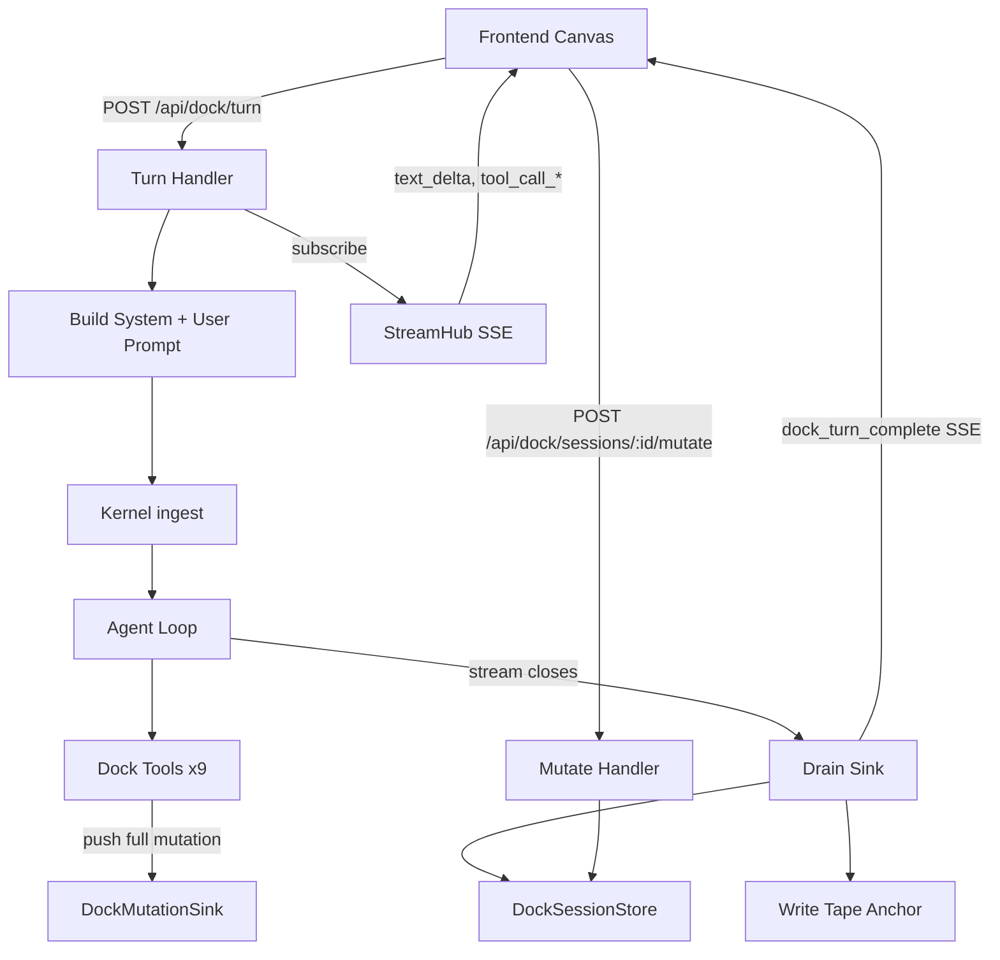

# Dock — Generative UI Canvas

Dock is Rara's collaborative canvas workbench. It provides a structured writing surface where the agent manipulates **blocks** (rich HTML content), **facts** (persistent context), and **annotations** (inline comments) through dedicated tools, while humans interact via a chat console and direct editing.

## Core Concepts

| Concept | Description |
|---|---|
| **Block** | A unit of canvas content (text, code, chart). Identified by ID, typed, carries HTML. |
| **Fact** | A persistent piece of context visible to the agent across turns (e.g. "target audience: engineers"). |
| **Annotation** | An inline comment attached to a block, authored by human or agent. |
| **Mutation** | An atomic CRUD operation on blocks, facts, or annotations. All state changes flow through mutations. |
| **Session** | A workspace containing blocks, facts, annotations, and history. Multiple sessions can coexist. |

## Architecture



### Turn Lifecycle

1. **Frontend** sends current canvas state (blocks, facts, annotations) + user message to `POST /api/dock/turn`.
2. **Turn handler** ensures a kernel session exists with a deterministic `SessionKey` derived from the dock session ID, then calls `kernel.ingest()`.
3. The handler returns an **SSE stream** that forwards kernel events (`text_delta`, `tool_call_start/end`) to the frontend in real time.
4. The **agent loop** calls dock tools (e.g. `dock.block.add`, `dock.fact.update`). Each tool pushes a full `DockMutation` into the shared `DockMutationSink` and returns a compact confirmation to the LLM.
5. When the stream closes, the handler **drains** all mutations from the sink, applies them to the `DockSessionStore`, writes a tape anchor with a canvas snapshot, and emits a final `dock_turn_complete` event with authoritative state.

### Human Edits

Human mutations (adding annotations, editing facts) go directly through `POST /api/dock/sessions/{id}/mutate` without involving the kernel.

## API Endpoints

| Method | Path | Description |
|---|---|---|
| GET | `/api/dock/bootstrap` | List sessions + active session ID |
| GET | `/api/dock/session?session_id=&selected_anchor=` | Load session state (optionally at a history anchor) |
| POST | `/api/dock/sessions` | Create a new session |
| POST | `/api/dock/sessions/:id/mutate` | Apply human mutations |
| POST | `/api/dock/turn` | Execute agent turn (returns SSE stream) |
| PATCH | `/api/dock/workspace` | Update active session |

## Dock Tools

Nine agent tools handle canvas CRUD:

| Tool | Operation |
|---|---|
| `dock.block.add` | Add a new canvas block |
| `dock.block.update` | Update block HTML content |
| `dock.block.remove` | Remove a block by ID |
| `dock.fact.add` | Add a persistent fact |
| `dock.fact.update` | Update fact content |
| `dock.fact.remove` | Remove a fact |
| `dock.annotation.add` | Add an annotation |
| `dock.annotation.update` | Update annotation content |
| `dock.annotation.remove` | Remove an annotation |

All tools share a `DockMutationSink` so full mutations bypass the kernel's truncated `result_preview` (2048 bytes).

## History & Time Travel

Each completed turn writes a **tape anchor** containing a `DockCanvasSnapshot` (blocks + facts). The frontend timeline shows these anchors. Selecting an anchor restores the historical canvas state from the snapshot.

After a live turn completes, the `dock_turn_complete` event resets `selected_anchor` to `null`, ensuring the UI exits history-viewing mode.

## Storage

```
~/.config/rara/dock/
├── workspace.json                — { active_session_id }
└── sessions/{id}/document.json   — { session, blocks, annotations, facts }
```

Session state is file-based JSON. Tape anchors (history) are stored separately by the kernel's tape system.

## Frontend

The dock frontend lives in `web/src/components/dock/`:

| Component | Role |
|---|---|
| `DockCanvas.tsx` | Main canvas rendering blocks |
| `DockBlockRenderer.tsx` | Individual block rendering with DOMPurify sanitization |
| `DockConsole.tsx` | Chat input for sending messages/commands |
| `DockSidebar.tsx` | Session list + navigation |
| `DockTimeline.tsx` | History anchor timeline |
| `DockAnnotations.tsx` | Annotation panel |
| `DockFacts.tsx` | Fact panel |
| `DockHeader.tsx` | Session header + controls |

State management is in `web/src/hooks/use-dock-store.ts` using React hooks. SSE streaming is handled by `web/src/api/dock.ts`.

## Security

- Block HTML is sanitized with **DOMPurify** using an explicit tag/attribute allowlist before rendering via `dangerouslySetInnerHTML`.
- Session IDs are validated to prevent path traversal in the file-based store.
