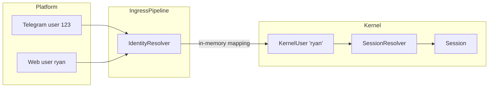

# Identity & User System

Rara uses a config-driven identity system that maps external platform accounts (Telegram, Web, CLI) to internal kernel users.

## Overview



The identity resolution flow has two stages:

1. **IdentityResolver** — maps `(channel_type, platform_user_id)` to a kernel `UserId`
2. **SessionResolver** — maps `(user, channel_type, chat_id)` to a `SessionKey`

## Configuration

Users and their platform bindings are defined in the YAML config file:

```yaml
users:
  - name: "ryan"
    role: root
    platforms:
      - type: telegram
        user_id: "123456789"
      - type: web
        user_id: "ryan"
  - name: "alice"
    role: user
    platforms:
      - type: telegram
        user_id: "987654321"
```

### Fields

| Field | Type | Required | Description |
|-------|------|----------|-------------|
| `name` | string | yes | Kernel user name (must be unique) |
| `role` | string | yes | `"root"`, `"admin"`, or `"user"` |
| `platforms` | array | no | Platform identity bindings |
| `platforms[].type` | string | yes | Channel type: `"telegram"`, `"web"`, `"cli"`, etc. |
| `platforms[].user_id` | string | yes | Platform-side user identifier |

### Roles and Permissions

| Role | Permissions | Description |
|------|-------------|-------------|
| `root` | `All` | Superuser, bypasses all checks |
| `admin` | `All` | Full access, used for service accounts |
| `user` | `Spawn` | Can spawn agent processes |

## Boot Sequence

At startup, Rara builds the identity system entirely from the `users` config (no database):

1. **`InMemoryUserStore`** — built from `users` config entries into a `HashMap<name, KernelUser>`
2. **`PlatformIdentityResolver`** — built from the `users` config as an in-memory `HashMap<(channel_type, platform_uid), user_name>`

Users are never persisted to the database — the YAML config is the single source of truth.

## Identity Resolution

`PlatformIdentityResolver` maps `(channel_type, platform_user_id)` to a kernel user name via an in-memory `HashMap` built from the `users` config.

If a message arrives from a platform user not listed in the config, the message is **rejected** with `IOError::IdentityResolutionFailed`. The event is logged at `debug` level.

## Architecture

### Key Types

| Type | Location | Description |
|------|----------|-------------|
| `UserId(String)` | `rara-kernel` | Runtime identity (user name) |
| `KernelUser` | `rara-kernel` | In-memory user record (UUID, role, permissions) |
| `Principal` | `rara-kernel` | Runtime security context derived from `KernelUser` |
| `UserConfig` | `rara-boot` | YAML config entry for a user |
| `PlatformBindingConfig` | `rara-boot` | YAML config entry for a platform binding |

### Key Components

| Component | Location | Responsibility |
|-----------|----------|----------------|
| `IdentityResolver` trait | `crates/kernel/src/io.rs` | Maps platform identity to `UserId` |
| `PlatformIdentityResolver` | `crates/boot/src/resolvers.rs` | Config-driven identity resolver (in-memory HashMap lookup) |
| `InMemoryUserStore` | `crates/boot/src/user_store.rs` | Config-driven in-memory user store |
| `SecuritySubsystem` | `crates/kernel/src/security.rs` | Validates user exists, is enabled, has permissions |
