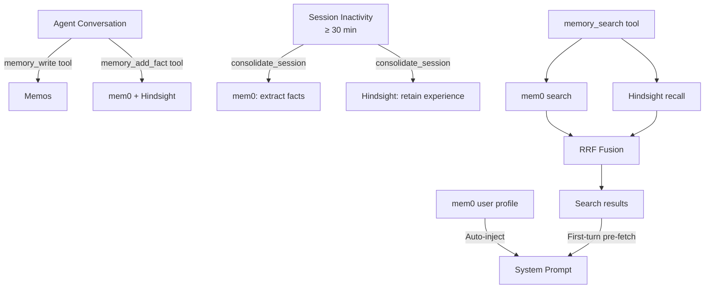

# Memory System

Rara's memory system gives the agent persistent, cross-session knowledge about the user. It uses three specialized external services, each addressing a different aspect of long-term agent memory.

## Architecture Overview

## Three-Layer Memory

| Service | Layer | Role | Trigger |
|---------|-------|------|---------|
| **mem0** | State | Structured fact extraction, auto-dedup, conflict resolution | Session-end + `memory_add_fact` tool |
| **Memos** | Storage | Human-readable Markdown notes with tags | `memory_write` tool only |
| **Hindsight** | Learning | 4-network retain/recall/reflect | Session-end + `memory_add_fact` tool |

### Trigger Timing Design

Each backend has a distinct trigger policy:

- **mem0** — fires at session-end (via `consolidate_session`) or explicit fact addition (via `add_fact`). **Never per-turn.**
- **Memos** — only written via the explicit `memory_write` tool. **No automatic writes.**
- **Hindsight** — fires at session-end (via `consolidate_session`) or explicit fact addition (via `add_fact`). **Never per-turn.**

### Session-End Detection

A session is considered "ended" when the inactivity gap exceeds 30 minutes (`SESSION_INACTIVITY_THRESHOLD`). When a user sends a new message to a session that has been idle for ≥30 min:

1. All previous (user, assistant) exchange pairs are extracted from the session history
2. `consolidate_session` batches them into one mem0 `add_memories` call + one Hindsight `retain` call
3. The consolidation runs as a fire-and-forget background task (does not block the new message)

## Memory Tools

| Tool | Purpose | Backends | When used |
|------|---------|----------|-----------|
| `memory_search` | Hybrid search across mem0 + Hindsight (RRF fusion) | mem0, Hindsight | Answering questions, recalling context |
| `memory_deep_recall` | Deep reasoning via Hindsight's 4-network reflect | Hindsight | Complex questions requiring synthesis |
| `memory_write` | Write a Markdown note with tags | Memos | Persisting notes, summaries, detailed context |
| `memory_add_fact` | Store a single explicit fact | mem0, Hindsight | Learning specific user facts on demand |

## Automatic Memory Behaviors

### 1. User Profile Injection

On every `send_message()` call, `get_user_profile()` queries mem0 for up to 50 structured facts about the user and prepends them to the system prompt as a "User Profile" section.

### 2. First-Turn Memory Pre-fetch

When a session has fewer than 3 messages (new or short session), `build_chat_system_prompt()` automatically runs `search(user_text, 5)` and injects matching snippets into the system prompt as "Relevant Memory Context".

### 3. Session-End Consolidation

When a session resumes after ≥30 minutes of inactivity, all previous exchanges are batch-consolidated into long-term memory:

1. Extracts all (user, assistant) exchange pairs from history
2. Sends all messages to mem0 for fact extraction (auto-dedup)
3. Retains the full session text in Hindsight's 4-network
4. Runs as a background `tokio::spawn` task — errors are logged but never block the response

## Search Pipeline

`MemoryManager::search()` queries mem0 and Hindsight **in parallel**, then merges results using Reciprocal Rank Fusion (RRF, k=60). Items appearing in both backends receive a boosted score.

Over-fetching: requests `max(limit * 3, 10)` candidates per backend to give RRF enough signal for re-ranking.

## Configuration

Memory settings via Consul KV or environment variables:

| Key | Default | Purpose |
|-----|---------|---------|
| `mem0_base_url` | `http://localhost:8080` | mem0 API server |
| `memos_base_url` | `http://localhost:5230` | Memos server |
| `memos_token` | — | Bearer token for Memos authentication |
| `hindsight_base_url` | `http://localhost:8888` | Hindsight API server |
| `hindsight_bank_id` | `default` | Hindsight memory bank identifier |

## Key Files

| File | Purpose |
|------|---------|
| `crates/memory/src/manager.rs` | `MemoryManager` — search, consolidate_session, add_fact, write_note |
| `crates/memory/src/mem0_client.rs` | mem0 REST client |
| `crates/memory/src/memos_client.rs` | Memos REST client |
| `crates/memory/src/hindsight_client.rs` | Hindsight REST client |
| `crates/memory/src/fusion.rs` | Reciprocal Rank Fusion algorithm |
| `crates/workers/src/tools/services/memory_tools.rs` | All 4 memory tools |
| `crates/chat/src/service.rs` | Session-end detection + consolidation trigger |
| `crates/agents/src/orchestrator/core.rs` | Profile injection + pre-fetch + spawn_session_consolidation |
