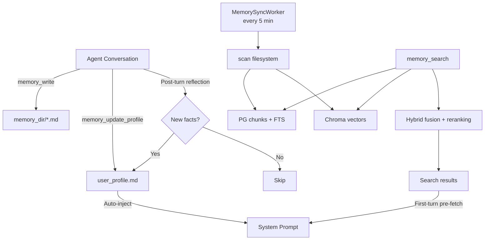

# Memory System

Rara's memory system gives the agent persistent, cross-session knowledge about the user. It follows a two-tier architecture inspired by [MemGPT/Letta](https://www.letta.com/blog/agent-memory) and [mem0](https://github.com/mem0ai/mem0).

## Architecture Overview



## Two-Tier Memory

### Tier 1: Core Memory (always in context)

The **user profile** (`memory_dir/user_profile.md`) is a structured markdown file that the agent maintains across conversations. It is automatically injected into every system prompt.

```markdown
# User Profile

## Basic Info
- Name: Ryan
- Role: Software engineer

## Preferences
- Language: Chinese for casual, English for technical
- Communication style: concise, practical

## Current Goals
- Building rara — personal AI assistant platform

## Key Context
- Uses Rust + React stack
- Interested in AI agents and automation
```

The agent updates this profile via the `memory_update_profile` tool, which surgically replaces individual sections.

### Tier 2: Archival Memory (searchable on demand)

All markdown files in `memory_dir/` are incrementally indexed into:

- **PostgreSQL** — full-text search via `tsvector` (keyword matching)
- **Chroma** — vector embeddings via server-side all-MiniLM-L6-v2 (semantic matching)

Search uses **hybrid fusion**: reciprocal rank fusion (0.65 keyword + 0.35 vector) followed by token-overlap reranking.

## Memory Tools

| Tool | Purpose | When used |
|------|---------|-----------|
| `memory_search` | Hybrid search across all indexed markdown | Answering questions, recalling context |
| `memory_get` | Fetch full chunk by ID | When a search snippet needs more detail |
| `memory_write` | Write new markdown file to memory | Persisting notes, summaries, detailed context |
| `memory_update_profile` | Update a section of `user_profile.md` | Learning new user facts (name, goals, prefs) |

## Automatic Memory Behaviors

### 1. Core Profile Injection

On every `send_message()` call, the user profile is read from disk and prepended to the system prompt. The agent always has core knowledge about the user without needing to search.

### 2. First-Turn Memory Pre-fetch

When a session has fewer than 3 messages (new or short session), `send_message()` automatically runs `memory_search(user_text, 5)` and injects matching snippets into the system prompt as context.

### 3. Post-Turn Memory Reflection

After every assistant response, an async fire-and-forget task runs a lightweight "reflection agent":

1. Takes the user message + assistant response
2. Asks the LLM: "Did you learn any new facts about the user?"
3. If yes, calls `memory_update_profile` to update the relevant section
4. Uses `max_iterations=1` to stay fast and cheap
5. Errors are logged but never block the response

### 4. Background Sync Worker

`MemorySyncWorker` runs every 5 minutes, calling `MemoryManager::sync()` to index any new or changed markdown files into PG + Chroma.

## Sync Pipeline

`MemoryManager::sync()` operates in 4 phases:

1. **Async**: Read current file index from PostgreSQL
2. **Blocking** (`spawn_blocking`): Walk filesystem, diff by mtime/size/hash, chunk changed files (1200 chars, 200 overlap)
3. **Async**: Upsert changed chunks to PG, delete stale entries
4. **Async**: Upsert chunks to Chroma for vector indexing

## Session Export

`ChatService::export_session_to_memory()` exports a session's full conversation to `memory_dir/sessions/{key}.md` as formatted markdown, making it searchable in future sessions.

## Configuration

Memory settings in `/api/v1/settings`:

```json
{
  "agent": {
    "memory": {
      "chroma_url": "http://localhost:8000",
      "chroma_collection": "job-memory",
      "chroma_api_key": null
    }
  }
}
```

Chroma is a required dependency. The default URL is `http://localhost:8000`.

## Key Files

| File | Purpose |
|------|---------|
| `crates/memory/src/manager.rs` | `MemoryManager` — sync, search, profile read/write |
| `crates/memory/src/store_pg.rs` | PostgreSQL chunk storage (async) |
| `crates/memory/src/chroma.rs` | Chroma vector client |
| `crates/memory/src/reranking.rs` | Token-overlap reranker |
| `crates/workers/src/tools/services/memory_tools.rs` | All 4 memory tools |
| `crates/workers/src/memory_sync.rs` | Background sync worker |
| `crates/chat/src/service.rs` | Profile injection + pre-fetch + reflection |
| `crates/paths/src/lib.rs` | `memory_dir()`, `memory_sessions_dir()` |
| `prompts/chat/default_system.md` | System prompt with memory instructions |
