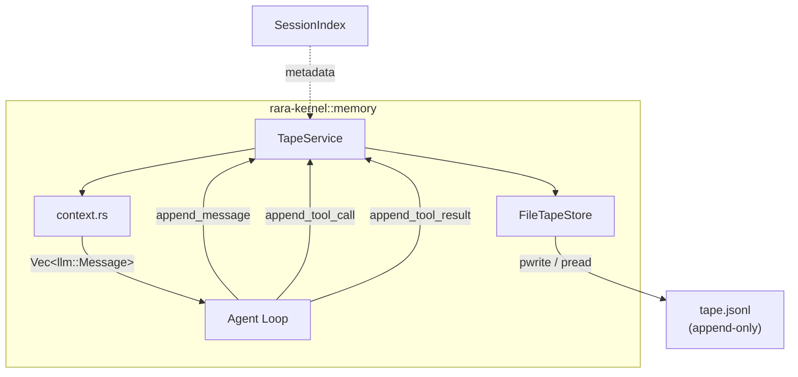
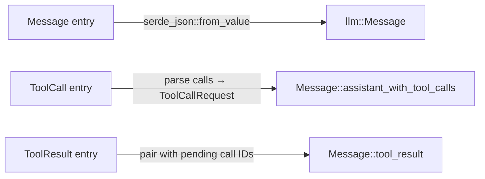
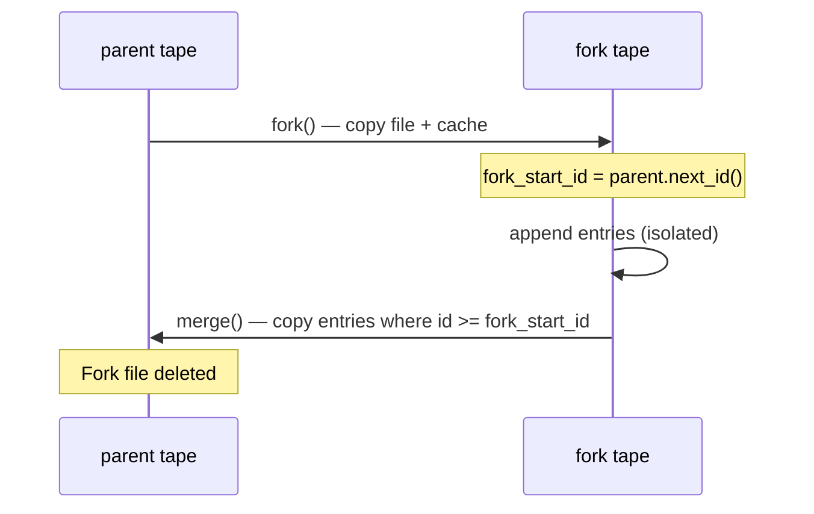

# Memory System

Rara uses a **tape-centric** memory architecture: every conversation event is persisted as an append-only JSONL record in a local file-backed tape. The tape module lives directly in the kernel crate (`rara-kernel::memory`) so that context reconstruction can produce typed `llm::Message` values without intermediate serialization.

## Architecture Overview

## Core Concepts

### Tape

A tape is a named, append-only sequence of [`TapEntry`] records persisted as JSONL. Each entry has:

| Field | Type | Description |
|-------|------|-------------|
| `id` | `u64` | Monotonic, append-order identifier |
| `kind` | `TapEntryKind` | Entry category |
| `payload` | `serde_json::Value` | Arbitrary JSON payload |
| `timestamp` | `jiff::Timestamp` | Persistence timestamp |

### Entry Kinds

| Kind | Purpose | Example payload |
|------|---------|-----------------|
| `Message` | User or assistant chat message | `{"role":"user","content":"..."}` |
| `ToolCall` | Assistant tool invocation | `{"calls":[{"id":"...","function":{...}}]}` |
| `ToolResult` | Tool execution output | `{"results":["..."]}` |
| `Event` | Lifecycle or telemetry event | `{"name":"run","data":{...}}` |
| `System` | System prompt content | `{"content":"..."}` |
| `Anchor` | Named checkpoint for windowing | `{"name":"session/start","state":{}}` |

### Anchors

Anchors partition a tape into logical windows. The most common anchor is `session/start`, created automatically by `ensure_bootstrap_anchor`. Context queries like `build_llm_context` read entries **from the most recent anchor forward**, keeping the LLM context window bounded without discarding history.

## Components

### `FileTapeStore`

Low-level storage engine. All I/O runs on a dedicated blocking thread (`rara-tape-io`) to avoid polluting the async runtime. The async API dispatches work via a channel-based `IoWorker`.

- **Storage format**: One JSONL file per tape, namespaced by workspace MD5 hash
- **File location**: `~/.rara/tapes/{workspace_hash}__{tape_name}.jsonl`
- **Caching**: Incremental — only new bytes are read on each access via positional `pread`/`pwrite` (rustix)
- **Concurrency**: Single-writer, serialized through the worker thread

Key operations:

| Method | Description |
|--------|-------------|
| `append(tape, kind, payload)` | Persist one entry |
| `read(tape)` | Read all entries (incremental cache) |
| `fork(source)` | Clone a tape for isolated work |
| `merge(source, target)` | Append fork-local entries back |
| `archive(tape)` | Move to timestamped `.bak` file |
| `reset(tape)` | Delete tape and clear cache |
| `list_tapes()` | List active tapes for workspace |

### `TapeService`

Higher-level API wrapping `FileTapeStore` with application-specific workflows:

| Method | Description |
|--------|-------------|
| `build_llm_context(tape_name)` | Reconstruct `Vec<llm::Message>` from entries since last anchor |
| `ensure_bootstrap_anchor(tape_name)` | Create initial `session/start` anchor if missing |
| `handoff(tape_name, name, state)` | Append an anchor and return post-anchor entries |
| `fork_tape(tape_name, func)` | Execute a closure against a forked tape, then auto-merge |
| `append_message / append_tool_call / append_tool_result` | Typed append helpers |
| `search(tape_name, query, limit, all_tapes)` | Substring + fuzzy search over message entries |
| `from_last_anchor(tape_name, kinds)` | Query entries after the most recent anchor |
| `anchors(tape_name, limit)` | List recent anchors |
| `info(tape_name)` | Tape statistics (entry count, anchors, token usage) |

### `context.rs` — LLM Context Reconstruction

Converts persisted tape entries directly into `Vec<llm::Message>`:

Because the tape module lives inside `rara-kernel`, `context.rs` constructs `llm::Message` directly — no intermediate `Value` representation or cross-crate type erasure.

## Fork / Merge Workflow

Forks enable isolated tape contexts for sub-agent or branch-and-merge workflows:

`TapeService::fork_tape` wraps this pattern with a closure and automatic merge on completion.

## Key Files

| File | Purpose |
|------|---------|
| `crates/kernel/src/memory/mod.rs` | Module root, core types (`TapEntry`, `TapEntryKind`) |
| `crates/kernel/src/memory/store.rs` | `FileTapeStore` — JSONL I/O, caching, fork/merge |
| `crates/kernel/src/memory/service.rs` | `TapeService` — anchor workflows, search, context building |
| `crates/kernel/src/memory/context.rs` | `default_tape_context` — tape entries → `Vec<llm::Message>` |
| `crates/kernel/src/memory/anchors.rs` | `AnchorSummary` type |
| `crates/kernel/src/memory/error.rs` | `TapError` / `TapResult` |
