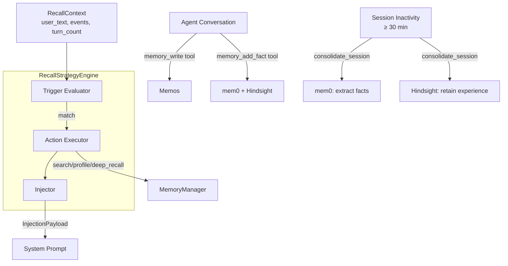

# Memory System

Rara's memory system gives the agent persistent, cross-session knowledge about the user. It consists of two layers: a **passive storage layer** (three external services) and an **active recall engine** (agent-configurable rules that decide when to invoke memory).

## Architecture Overview



## Passive Layer: Three-Service Memory

| Service | Layer | Role | Write Trigger |
|---------|-------|------|---------------|
| **mem0** | State | Structured fact extraction, auto-dedup, conflict resolution | Session-end + `memory_add_fact` tool |
| **Memos** | Storage | Human-readable Markdown notes with tags | `memory_write` tool only |
| **Hindsight** | Learning | 4-network retain/recall/reflect | Session-end + `memory_add_fact` tool |

### Write Timing

- **mem0 + Hindsight** — fire at session-end (via `consolidate_session`) or explicit `add_fact`. **Never per-turn.**
- **Memos** — only via the `memory_write` tool. **No automatic writes.**

### Session-End Detection

A session is considered "ended" when the inactivity gap exceeds 30 minutes. When a user sends a new message to an idle session:

1. All previous (user, assistant) exchange pairs are extracted
2. `consolidate_session` batches them into one mem0 `add_memories` + one Hindsight `retain`
3. Runs as fire-and-forget background task

## Active Layer: Recall Strategy Engine

The real intelligence is not in memory storage but in **when to invoke memory**. The `RecallStrategyEngine` is a rule-based engine that agents can configure at runtime.

### How It Works

Each conversation turn, the engine:

1. **Builds a `RecallContext`** — user_text, turn_count, events (Compaction/NewSession/SessionResume), elapsed time, summary
2. **Evaluates all enabled rules** — walks each rule's trigger tree recursively
3. **Executes matched actions** — calls MemoryManager (search, deep_recall, get_profile)
4. **Returns injection payloads** — content + target (SystemPrompt or ContextMessage)

### Trigger Types

Triggers are composable trees using And/Or/Not combinators:

| Trigger | Description |
|---------|-------------|
| `KeywordMatch { keywords }` | User message contains any keyword (case-insensitive) |
| `Event { kind }` | System event occurred: `Compaction`, `NewSession`, `SessionResume` |
| `EveryNTurns { n }` | Fires every N turns |
| `InactivityGt { seconds }` | Session was idle for > N seconds |
| `Always` | Fires every turn |
| `And { conditions }` | All conditions must match |
| `Or { conditions }` | Any condition suffices |
| `Not { condition }` | Negation |

### Action Types

| Action | Description |
|--------|-------------|
| `Search { query_template, limit }` | Semantic search across mem0 + Hindsight (RRF) |
| `DeepRecall { query_template }` | Hindsight deep reasoning (reflect) |
| `GetProfile` | Retrieve user profile facts from mem0 |

### Query Templates

Templates support variable interpolation:
- `{user_text}` — current user message
- `{summary}` — compaction summary (only on Compaction event)
- `{session_topic}` — session title/preview

Example: `"resume optimization {user_text}"` → `"resume optimization 我想改简历"`

### Default Rules

Seeded on first startup — agents can modify or replace them:

| Name | Trigger | Action | Priority |
|------|---------|--------|----------|
| `user-profile` | `Always` | `GetProfile` → SystemPrompt | 0 |
| `new-session-context` | `Event(NewSession)` | `Search("{user_text}", 5)` → SystemPrompt | 5 |
| `post-compaction` | `Event(Compaction)` | `Search("{summary}", 5)` → SystemPrompt | 10 |
| `session-resume` | `Event(SessionResume)` | `Search("{user_text}", 3)` → SystemPrompt | 20 |

### Agent-Created Rules (Examples)

Agents can register custom rules at runtime:

```json
{
  "name": "resume-context",
  "trigger": { "type": "KeywordMatch", "keywords": ["简历", "resume", "CV"] },
  "action": { "type": "Search", "query_template": "resume optimization {user_text}", "limit": 3 },
  "inject": "SystemPrompt",
  "priority": 10
}
```

```json
{
  "name": "periodic-deep-recall",
  "trigger": { "type": "EveryNTurns", "n": 10 },
  "action": { "type": "DeepRecall", "query_template": "synthesize learnings about {session_topic}" },
  "inject": "SystemPrompt",
  "priority": 50
}
```

## Memory Tools

### Storage Tools

| Tool | Purpose | Backends |
|------|---------|----------|
| `memory_search` | Hybrid search (RRF fusion) | mem0 + Hindsight |
| `memory_deep_recall` | Deep reasoning via 4-network reflect | Hindsight |
| `memory_write` | Write a Markdown note with tags | Memos |
| `memory_add_fact` | Store a single explicit fact | mem0 + Hindsight |

### Recall Strategy Tools

| Tool | Purpose |
|------|---------|
| `recall_strategy_add` | Register a new recall rule (trigger + action + inject target) |
| `recall_strategy_list` | List all rules with status |
| `recall_strategy_update` | Update a rule (enable/disable, modify trigger/action/priority) |
| `recall_strategy_remove` | Delete a rule by ID |

## Search Pipeline

`MemoryManager::search()` queries mem0 and Hindsight **in parallel**, then merges results using Reciprocal Rank Fusion (RRF, k=60). Over-fetches `max(limit * 3, 10)` candidates per backend.

## Configuration

Memory settings via Consul KV or environment variables:

| Key | Default | Purpose |
|-----|---------|---------|
| `mem0_base_url` | `http://localhost:8080` | mem0 API server |
| `memos_base_url` | `http://localhost:5230` | Memos server |
| `memos_token` | — | Bearer token for Memos authentication |
| `hindsight_base_url` | `http://localhost:8888` | Hindsight API server |
| `hindsight_bank_id` | `default` | Hindsight memory bank identifier |
| `recall_every_turn` | `false` | Legacy: use recall engine rules instead |

## Key Files

| File | Purpose |
|------|---------|
| `crates/memory/src/manager.rs` | `MemoryManager` — search, consolidate_session, add_fact, write_note |
| `crates/memory/src/recall_engine/` | Recall strategy engine (types, engine, interpolation, defaults) |
| `crates/memory/src/mem0_client.rs` | mem0 REST client |
| `crates/memory/src/memos_client.rs` | Memos REST client |
| `crates/memory/src/hindsight_client.rs` | Hindsight REST client |
| `crates/memory/src/fusion.rs` | Reciprocal Rank Fusion algorithm |
| `crates/workers/src/tools/services/memory_tools.rs` | Memory + recall strategy tools |
| `crates/chat/src/service.rs` | Session-end detection + consolidation trigger |
| `crates/agents/src/orchestrator/core.rs` | run_recall_engine + spawn_session_consolidation |
| `crates/agents/src/builtin/chat.rs` | RecallContext assembly + engine invocation |
