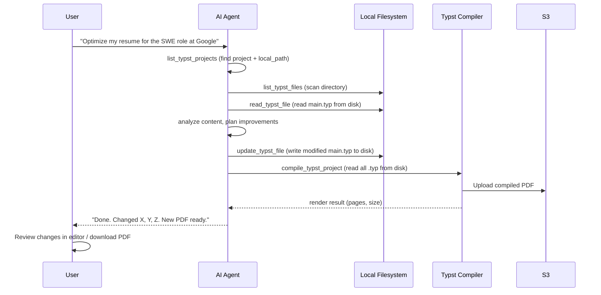

# Resume AI Agent

The AI agent can analyze, modify, and compile user resumes through a set of specialized tools. All file operations happen directly on the user's local filesystem — the agent reads and writes `.typ` files on disk, then triggers compilation to generate updated PDFs.

## Agent Tools

### Resume Tools

Registered in `crates/workers/src/tools/services/resume_tools.rs`.

#### `list_resumes`

List all resumes with optional source filter.

**Parameters:**

| Name | Type | Required | Description |
|------|------|----------|-------------|
| `source` | string | No | Filter: `manual`, `ai_generated`, or `optimized` |

**Returns:** Array of resume summaries (id, title, source, tags, version_tag).

#### `get_resume_content`

Retrieve full resume content by ID.

**Parameters:**

| Name | Type | Required | Description |
|------|------|----------|-------------|
| `resume_id` | string | Yes | UUID of the resume |

**Returns:** Complete resume fields including content text.

#### `analyze_resume`

Analyze a resume and produce an optimization report. Uses `ResumeAnalyzerAgent` with a specialized system prompt for professional resume consulting.

**Parameters:**

| Name | Type | Required | Description |
|------|------|----------|-------------|
| `resume_id` | string | Yes | UUID of the resume to analyze |

**Analysis dimensions:**

1. **Content completeness** — contact info, work experience, education, skills
2. **Wording quality** — action verbs, quantified achievements, clarity
3. **Structure and format** — section organization, length, readability
4. **ATS compatibility** — keyword coverage, format simplicity
5. **Job match** — skill alignment with target job (when `target_job_id` is set)

### Typst Tools

Registered in `crates/workers/src/tools/services/typst_tools.rs`. All file operations go through `TypstService` which reads/writes directly from the user's local filesystem.

#### `list_typst_projects`

List all registered Typst projects.

**Parameters:** None.

**Returns:** Array of projects (id, name, local_path, main_file, git_url).

#### `list_typst_files`

Scan the project directory on disk and list all files.

**Parameters:**

| Name | Type | Required | Description |
|------|------|----------|-------------|
| `project_id` | string | Yes | UUID of the project |

**Returns:** File tree with nested directory structure.

#### `read_typst_file`

Read file content directly from disk.

**Parameters:**

| Name | Type | Required | Description |
|------|------|----------|-------------|
| `project_id` | string | Yes | UUID of the project |
| `file_path` | string | Yes | Relative file path (e.g., `main.typ`) |

**Returns:** Full file text content from the local filesystem.

#### `update_typst_file`

Write file content directly to disk.

**Parameters:**

| Name | Type | Required | Description |
|------|------|----------|-------------|
| `project_id` | string | Yes | UUID of the project |
| `file_path` | string | Yes | Relative file path |
| `content` | string | Yes | New file content |

**Returns:** Write confirmation. The file is immediately updated on the user's filesystem.

#### `compile_typst_project`

Read all `.typ` files from disk and compile to PDF.

**Parameters:**

| Name | Type | Required | Description |
|------|------|----------|-------------|
| `project_id` | string | Yes | UUID of the project |

**Returns:** Compilation result (render_id, page_count, file_size, source_hash).

## AI-Driven Workflow

The agent operates directly on the user's local files:



### Example Conversation

```
User: 帮我优化简历中的工作经验部分，加上量化数据

Agent: 让我先查看你的简历项目。
→ [calls list_typst_projects]
  Found: "my-resume" at ~/projects/resume/

→ [calls list_typst_files]
  Files: main.typ, sections/experience.typ, sections/skills.typ

→ [calls read_typst_file for "sections/experience.typ"]
  Reading from disk: ~/projects/resume/sections/experience.typ

Agent: 我已经阅读了你的简历，发现以下可优化的点：
1. "负责后端开发" → 缺少量化成果
2. "优化系统性能" → 未指明提升幅度
3. "参与项目管理" → 缺少团队规模和项目范围

让我帮你修改：
→ [calls update_typst_file for "sections/experience.typ"]
  Writing to disk: ~/projects/resume/sections/experience.typ
→ [calls compile_typst_project]
  Compiling from: ~/projects/resume/

Agent: 已完成修改并重新编译。主要改动：
- "负责后端开发" → "主导后端微服务架构设计，支撑日均 500 万请求"
- "优化系统性能" → "将 API 响应时间从 800ms 降至 120ms（提升 85%）"
- "参与项目管理" → "带领 6 人团队交付 3 个季度 OKR 项目"

新 PDF 已生成（2 页，42KB），可在编辑器中预览。
文件已直接保存到你的本地项目目录。
```

## Security

### Path Traversal Protection

All file operations validate that resolved paths stay within the project root:

- Paths containing `..` are rejected
- Symlinks escaping the root directory are blocked
- Returns `PathTraversal` error on violation

This prevents the AI agent (or any API caller) from reading/writing files outside the registered project directory.

## Implementation Files

| File | Purpose |
|------|---------|
| `crates/domain/typst/src/fs.rs` | Local filesystem operations with path safety |
| `crates/workers/src/tools/services/resume_tools.rs` | Resume agent tools |
| `crates/workers/src/tools/services/typst_tools.rs` | Typst agent tools (disk-based) |
| `crates/ai/src/agents/resume_analyzer.rs` | Resume analysis AI agent |
| `crates/workers/src/worker_state.rs` | Tool registration |
