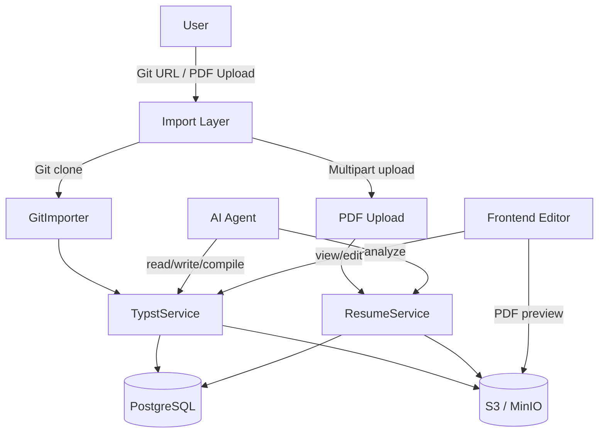

# Typst Resume System

The Typst Resume System enables AI-driven resume management. Users import their Typst resume projects (via Git or PDF upload), and the AI agent analyzes, modifies, and recompiles resumes automatically.

## Architecture



## Domain Crates

### `rara-domain-typst`

Manages Typst projects, files, and compilation.

**Location:** `crates/domain/typst/`

**Key modules:**

| Module | Purpose |
|--------|---------|
| `types.rs` | `TypstProject`, `TypstFile`, `RenderResult` |
| `compiler.rs` | Typst-to-PDF compilation via `typst-as-lib` |
| `git.rs` | Git repository clone and sync via `git2` |
| `service.rs` | Business logic: CRUD, compile, import, sync |
| `router.rs` | 15 REST API endpoints |
| `pg_repository.rs` | PostgreSQL persistence |

**Database tables:**

- `typst_project` — project metadata, optional `git_url`
- `typst_file` — file content (path + text), belongs to project
- `typst_render` — compilation results, references S3 PDF object

### `rara-domain-resume` (extended)

Extended with PDF upload/download capability.

**New fields on `resume` table:**
- `pdf_object_key TEXT` — S3 object key for uploaded PDF
- `pdf_file_size BIGINT` — file size in bytes

## API Reference

### Typst Projects

| Method | Path | Description |
|--------|------|-------------|
| `POST` | `/api/v1/typst/projects` | Create project |
| `GET` | `/api/v1/typst/projects` | List projects |
| `GET` | `/api/v1/typst/projects/{id}` | Get project |
| `DELETE` | `/api/v1/typst/projects/{id}` | Delete project |
| `POST` | `/api/v1/typst/projects/import-git` | Import from Git URL |
| `POST` | `/api/v1/typst/projects/{id}/git-sync` | Sync Git changes |

### Typst Files

| Method | Path | Description |
|--------|------|-------------|
| `POST` | `/api/v1/typst/projects/{id}/files` | Create file |
| `GET` | `/api/v1/typst/projects/{id}/files` | List files |
| `GET` | `/api/v1/typst/projects/{id}/files/{path}` | Get file content |
| `PUT` | `/api/v1/typst/projects/{id}/files/{path}` | Update file |
| `DELETE` | `/api/v1/typst/projects/{id}/files/{path}` | Delete file |

### Compilation & Rendering

| Method | Path | Description |
|--------|------|-------------|
| `POST` | `/api/v1/typst/projects/{id}/compile` | Compile to PDF |
| `GET` | `/api/v1/typst/projects/{id}/renders` | List render history |
| `GET` | `/api/v1/typst/renders/{id}/pdf` | Download rendered PDF |

### Resume PDF

| Method | Path | Description |
|--------|------|-------------|
| `POST` | `/api/v1/resumes/upload` | Upload PDF (multipart) |
| `GET` | `/api/v1/resumes/{id}/pdf` | Download resume PDF |

## Compilation Engine

The compiler is built on `typst-as-lib`, which wraps the official Typst compiler.

**Flow:**

1. Service collects all `TypstFile` records for a project
2. Files are assembled into an in-memory file map
3. `TypstCompiler::compile()` invokes `typst-as-lib` with the file map
4. On success, PDF bytes are uploaded to S3 (`typst/renders/{render_id}.pdf`)
5. A `RenderResult` record is created with metadata (page count, file size, source hash)

**Source hash caching:** The compiler hashes all source files before compiling. If the hash matches the latest render, compilation is skipped and the existing result is returned.

## Git Integration

The `GitImporter` supports importing Typst projects from Git repositories.

**Constraints:**
- HTTPS URLs only (no SSH, no local paths)
- Shallow clone (depth=1) for efficiency
- 60-second timeout
- 50MB total file size limit
- Scanned file types: `.typ`, `.bib`, `.csv`, `.yaml`, `.yml`, `.json`, `.toml`

**Import flow:**

1. Validate URL format
2. Clone to temporary directory via `git2`
3. Recursively scan for supported file types
4. Create `TypstProject` with `git_url` field
5. Bulk-insert `TypstFile` records
6. Auto-detect main file (`main.typ` preferred)
7. Clean up temporary directory

**Sync:** Re-clones the repository and performs a full file replacement (delete all + re-insert).

## PDF Upload

Resume PDF upload uses `axum::extract::Multipart` with the following validations:

- File size limit: 10MB
- Content validation: PDF magic bytes (`%PDF`)
- Storage path: `resumes/{resume_id}/original.pdf`
- Creates a `Resume` record with `source = Manual`

## Frontend

### Typst Projects Page (`/typst`)

- Project list with create/delete
- "Import from Git" dialog
- Git projects show sync button with last-synced timestamp

### Typst Editor Page (`/typst/:projectId`)

Three-panel layout:

```
+------------+--------------------+------------------+
| File Tree  | CodeMirror Editor  | PDF Preview      |
|            |                    |                  |
| main.typ   | [Typst code...]    | [Rendered PDF]   |
| style.typ  |                    |                  |
|            |                    | [Compile]        |
| [New File] |                    | [History]        |
+------------+--------------------+------------------+
```

**Editor features:**
- CodeMirror 6 with markdown language support and one-dark theme
- Auto-save with 1-second debounce
- Manual save with Ctrl+S

**Preview features:**
- PDF rendered via iframe with blob URL
- Compile button with loading indicator
- Expandable render history list
