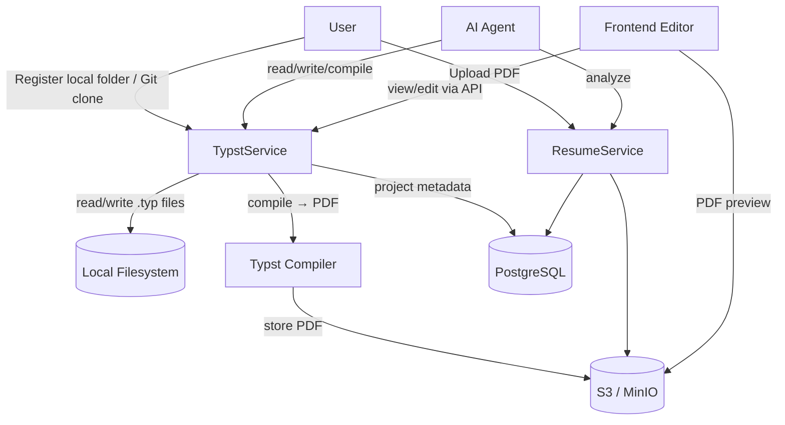

# Typst Resume System

The Typst Resume System enables AI-driven resume management. Users register their local Typst resume project folders (or clone from Git), and the AI agent reads, analyzes, modifies, and recompiles resumes directly on the local filesystem.

## Architecture

This application runs locally on the user's machine. The backend accesses the user's filesystem directly — no file content is stored in the database.



### Data Flow

| Data | Storage |
|------|---------|
| `.typ` source files | User's local filesystem (never copied to DB) |
| Project metadata (id, name, local_path) | PostgreSQL |
| Compiled PDFs | S3 / MinIO |
| Render history | PostgreSQL |

## Domain Crates

### `rara-domain-typst`

Manages Typst projects, local file access, and compilation.

**Location:** `crates/domain/typst/`

**Key modules:**

| Module | Purpose |
|--------|---------|
| `types.rs` | `TypstProject`, `RenderResult`, `FileEntry` |
| `fs.rs` | Local filesystem operations: scan, read, write, path validation |
| `compiler.rs` | Typst-to-PDF compilation via `typst-as-lib` |
| `git.rs` | Git repository clone via `git2` |
| `service.rs` | Business logic: register, compile, file access |
| `router.rs` | REST API endpoints |
| `pg_repository.rs` | PostgreSQL persistence (project metadata + renders only) |

**Database tables:**

- `typst_project` — project metadata: `id`, `name`, `local_path`, `main_file`, `git_url`
- `typst_render` — compilation results, references S3 PDF object

Note: There is no `typst_file` table. File content lives on disk only.

### `rara-domain-resume` (extended)

Extended with PDF upload/download capability.

**New fields on `resume` table:**
- `pdf_object_key TEXT` — S3 object key for uploaded PDF
- `pdf_file_size BIGINT` — file size in bytes

## Filesystem Module (`fs.rs`)

The `fs` module provides safe local filesystem operations.

### Path Traversal Protection

All file operations validate that the resolved path stays within the project root directory:

```rust
pub fn validate_path(root: &Path, relative: &str) -> Result<PathBuf, TypstError>
```

Rejects paths containing `..` or symlinks that escape the root. Returns `PathTraversal` error on violation.

### Key Functions

| Function | Description |
|----------|-------------|
| `scan_directory(root)` | Recursively scan directory, return `Vec<FileEntry>` tree |
| `read_file(root, relative)` | Read file content as string |
| `write_file(root, relative, content)` | Write content to file |
| `collect_typ_files(root)` | Collect all `.typ` files as `HashMap<path, content>` for compilation |

Hidden directories (`.git`, `.github`, etc.) are automatically excluded from scans.

## API Reference

### Typst Projects

| Method | Path | Description |
|--------|------|-------------|
| `POST` | `/api/v1/typst/projects` | Register local project (accepts `local_path`) |
| `GET` | `/api/v1/typst/projects` | List projects |
| `GET` | `/api/v1/typst/projects/{id}` | Get project |
| `DELETE` | `/api/v1/typst/projects/{id}` | Unregister project (does not delete local files) |
| `POST` | `/api/v1/typst/projects/import-git` | Clone Git repo to local dir, then register |
| `POST` | `/api/v1/typst/projects/{id}/git-sync` | Pull latest changes from Git |

### Typst Files (Local Filesystem)

| Method | Path | Description |
|--------|------|-------------|
| `GET` | `/api/v1/typst/projects/{id}/files` | Scan directory, return file tree |
| `GET` | `/api/v1/typst/projects/{id}/files/{path}` | Read file from disk |
| `PUT` | `/api/v1/typst/projects/{id}/files/{path}` | Write file to disk |

### Compilation & Rendering

| Method | Path | Description |
|--------|------|-------------|
| `POST` | `/api/v1/typst/projects/{id}/compile` | Compile from disk to PDF |
| `GET` | `/api/v1/typst/projects/{id}/renders` | List render history |
| `GET` | `/api/v1/typst/renders/{id}/pdf` | Download rendered PDF |

### Resume PDF

| Method | Path | Description |
|--------|------|-------------|
| `POST` | `/api/v1/resumes/upload` | Upload PDF (multipart) |
| `GET` | `/api/v1/resumes/{id}/pdf` | Download resume PDF |

## Compilation Engine

The compiler is built on `typst-as-lib`, which wraps the official Typst compiler.

**Flow:**

1. `fs::collect_typ_files()` reads all `.typ` files from the project directory on disk
2. Files are assembled into an in-memory file map
3. `TypstCompiler::compile()` invokes `typst-as-lib` with the file map
4. On success, PDF bytes are uploaded to S3 (`typst/renders/{render_id}.pdf`)
5. A `RenderResult` record is created with metadata (page count, file size, source hash)

**Source hash caching:** The compiler hashes all source files before compiling. If the hash matches the latest render, compilation is skipped and the existing result is returned.

## Git Integration

The `GitImporter` clones repositories to a user-specified local directory, then registers the directory as a Typst project.

**Constraints:**
- HTTPS URLs only (no SSH, no local paths)
- Shallow clone (depth=1) for efficiency
- 60-second timeout

**Import flow:**

1. Validate URL format
2. Clone to user-specified target directory via `git2`
3. Register the target directory as a local Typst project
4. Auto-detect main file (`main.typ` preferred)

**Sync:** Re-clones the repository into the same local directory.

## PDF Upload

Resume PDF upload uses `axum::extract::Multipart` with the following validations:

- File size limit: 10MB
- Content validation: PDF magic bytes (`%PDF`)
- Storage path: `resumes/{resume_id}/original.pdf`
- Creates a `Resume` record with `source = Manual`

## Frontend

### Typst Projects Page (`/typst`)

- Project list with local path display
- "Add Project" button — register an existing local folder by path
- "Import from Git" dialog — clone to a local directory then register
- Git projects show sync button with last-synced timestamp
- Delete removes the database record only (local files are untouched)

### Typst Editor Page (`/typst/:projectId`)

Three-panel layout:

```
+------------+--------------------+------------------+
| File Tree  | CodeMirror Editor  | PDF Preview      |
|            |                    |                  |
| src/       | [Typst code...]    | [Rendered PDF]   |
|  main.typ  |                    |                  |
|  style.typ |                    | [Compile]        |
| assets/    |                    | [History]        |
+------------+--------------------+------------------+
```

**File tree:** Recursive tree component with expand/collapse for directories. Files are read from disk via the backend API.

**Editor features:**
- CodeMirror 6 with markdown language support and one-dark theme
- Auto-save with 1-second debounce (writes to local disk via API)
- Manual save with Ctrl+S

**Preview features:**
- PDF rendered via iframe with blob URL
- Compile button with loading indicator
- Expandable render history list
